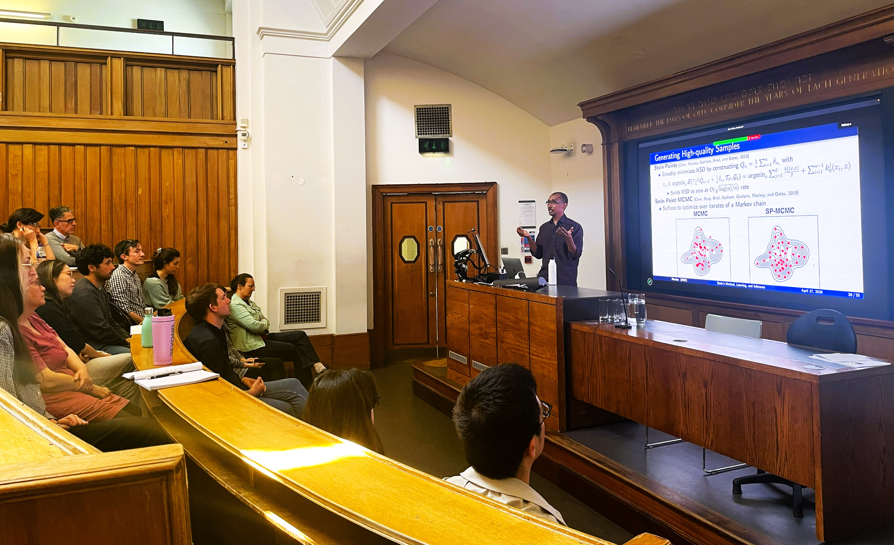
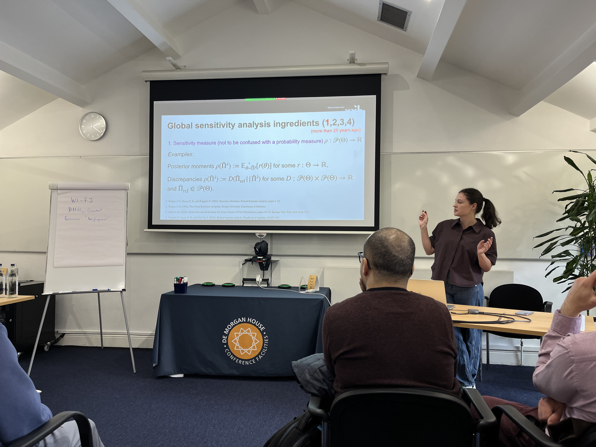
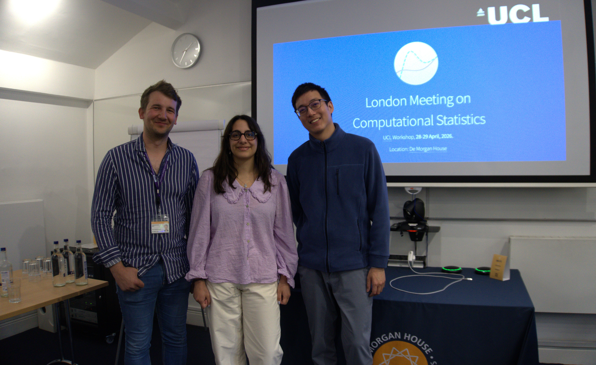
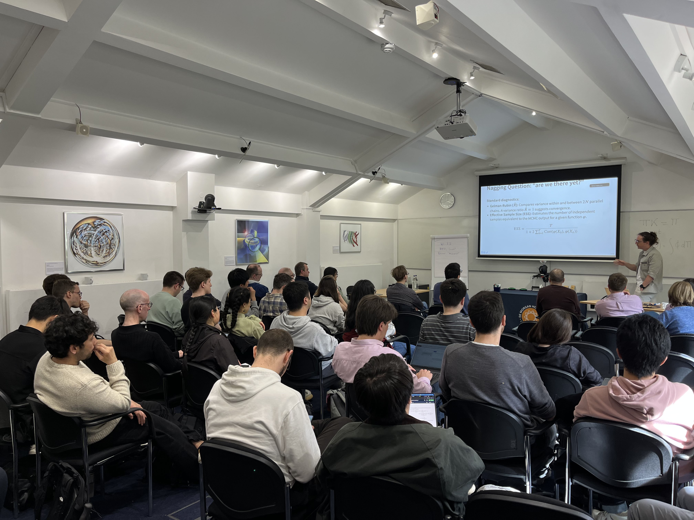
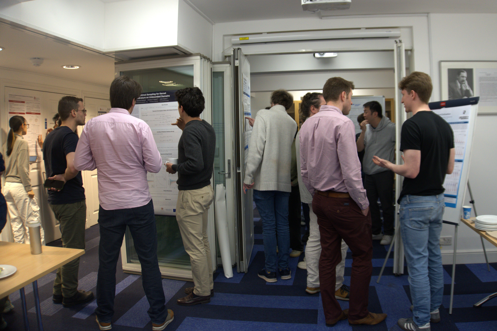

The annual lecture was on the theme of 'Computational Statistics and Machine Learning' (CSML), and the keynote speaker was Dr Lester Mackey from Microsoft Research New England. Dr Mackey spoke about 'Stein's Method, Learning, and Inference', an emerging interface between probability theory with statistics and machine learning that he helped found over 10 years ago and which has led to significant advances in sampling methods, hypothesis testing, parameter estimation, generative modelling, and optimisation. 

:::{}

:::

Dr Mackey's keynote was accompanied by several talks including by Prof. Po-Ling Loh (University of Cambridge), Paula Cordero Encinar (Imperial College London) and our very own Dr. Alessandro Barp. These talks spanned topics across the CSML spectrum from inference under privacy constraints to the role of geometry in statistics, and uncertainty quantification in large language models. This was a very popular event, with over 150 attendees from across UCL and beyond. 

:::{layout="[[1,1]]"}

:::

Later in the week, we had the 'London Meeting on Computational Statistics', which was the second event of its kind organised by our department following an earlier edition held in 2024. Talks covered a broad range of topics including Monte Carlo methods, simulation-based inference, generative modelling, generalisations of Bayesian inference, sensitivity analysis, conformal prediction and much more. The meeting brought together academic researchers from across the UK and Europe, as well as industry speakers and attendees from Apple, DeepMind, Google and Microsoft.

The event was a victim of its own success, with registrations having to close early due to capacity constraints and over 90% of submitted talks having to be rejected due to scheduling constraints. 

:::{layout="[[1,1]]"}

:::

A huge thank you for the organisation should go to [Harita Dellaporta](https://haritadell.github.io/), [Zonghao Chen](https://hudsonchen.github.io/), [William Laplante](https://williamlaplante.github.io/), [Matias Altamirano](https://maltamiranomontero.github.io/) and the broader [Fundamentals of Statistical Machine Learning research group](https://fsml-ucl.github.io/). Thanks also to Stephanie Dickinson for some of the photos, and to Amanda Gallant for supporting with the IMSS lecture.

:::{layout="[[1,1]]"}

:::



 



