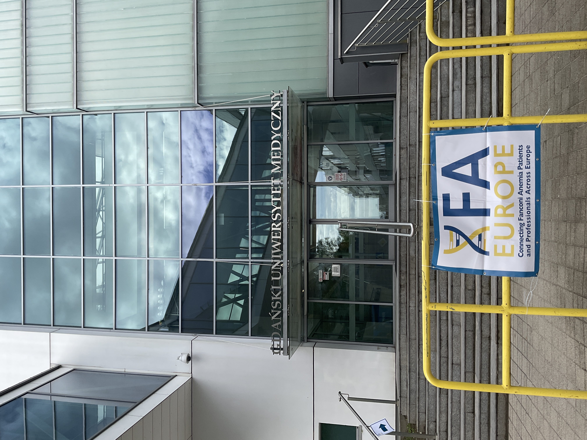
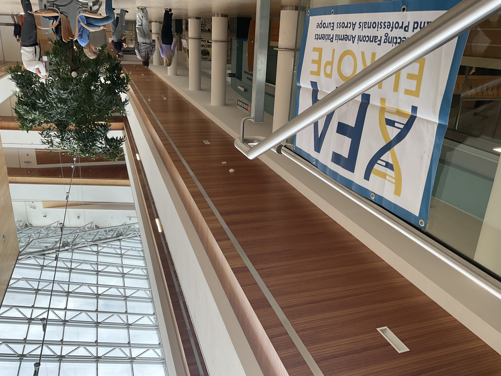
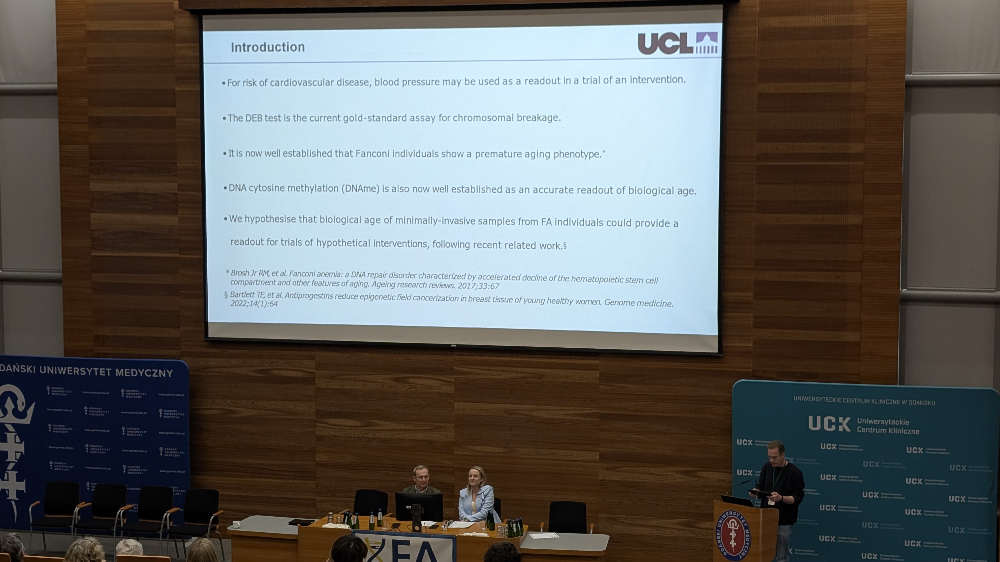
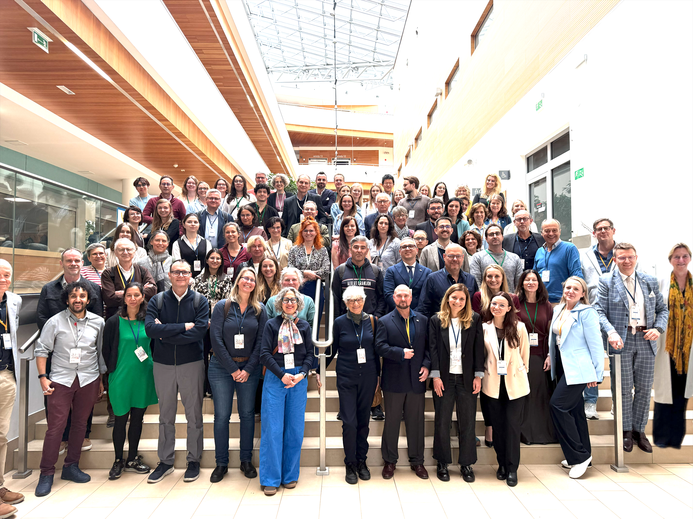

The [FA Europe conference](https://faeurope.org/) brings together international experts on the rare disease Fanconi Anemia (FA), including researchers and clinicians, as well as patients and their families. This setting provides a unique opportunity for those of us who usually work in the relative isolation of a [Statistical Science Department](https://www.ucl.ac.uk/mathematical-physical-sciences/statistics), to connect more directly with those who would make use of, and potentially benefit from, the computational-statistical technologies that we develop. I found the conference was very informative and rewarding; it has lead to new, and strengthened old collaborations and friendships. 

:::{}

{width=60% fig-align="center"}

:::

Fanconi anemia (FA) is a rare hereditary chromosomal instability disorder, characterised by inefficient repair of certain types of DNA damage. FA is now widely recognised as a disease of premature aging. The novel computational-statistical methodology we developed for this application, allowed us to show for the first time that this accelerated aging in FA proceeds in a way that is specific to the type of cell and its lineage, based on measurements of DNA methylation levels in minimally-invasive peripheral blood samples. The importance of these findings is in providing a proof-of-principle for a DNA-based readout of cellular aging in FA individuals. Such a readout could have important clinical applications, including in trials of interventions. Such interventions would aim to deplete sub-populations of cells that show signs of aging and hence may lead to disease, for example as a result of DNA damage. 

:::{}

{width=70% fig-align="center"}

:::

Our novel computational-statistical methodology for inferring cell-age biomarkers has been developed in collaboration with world-expert clinicians Stefan Meyer (University of Manchester) and Vivian Chang (UCLA, USA). Access to the unpublished Fanconi Anemia data that we used to validate our hypotheses was kindly provided by Jordi Surralles (IR Sant Pau, Barcelona, Spain) and Marco Tartaglia (Ospedale Pediatrico Bambino Gesù, IRCCS, Rome, Italy). This collaboration followed an introduction via the [Fanconi Cancer Foundation FRIENDS Data Project](https://fanconi.org/data-project/) meetings. For our study, we curated a large training data-set from [publicly-available sources](https://www.ncbi.nlm.nih.gov/geo/), of DNA methylation measurements from over 7700 healthy blood samples from individuals aged 1-94 years. We used this training data-set to validate existing DNA methylation age biomarkers, as well as to define new age biomarkers for specific cell types, using our novel mathematical-biological model. 

The computational-statistical model that we used with this large training data-set serves as a proof-of-principle for our mathematical-biological modelling approach. However, the implementation of this computational-statistical model is a general supervised learning task that fits exactly within the scope of the skills that we teach students in the [Department of Statistical Science](https://www.ucl.ac.uk/mathematical-physical-sciences/statistics) at UCL. So, this supervised learning model development has already been spun out as a student project within the department. This project will give a talented student the opportunity to use and build on the skills that they have learnt during their degree at UCL, to improve this model implementation, and make a real contribution to the larger project. The aim is to continue to set up student projects like this, to give the next generation of researchers exposure to this important, but less visible, field of research.

{width=90% fig-align="center"}

Rare disease research is often limited by data-sets with very small sample-sizes, preventing important patterns from being identified in the data, or scientific hypotheses from being tested at an appropriate level of statistical significance. Increasing sample size by combining data-sets in a meta-study is often hindered by difficulties finding suitable data-sets, incompatibility of record keeping, and sometimes even data hoarding by individual researchers against the interests of the data donors. To overcome these and other challenges, the [Fanconi Cancer Foundation FRIENDS Data Project](https://fanconi.org/data-project/) (in collaboration with the [University of Chicago Data for the Common Good](https://commons.cri.uchicago.edu/)) is in the final stages of setting up their Data Commons repository, to gather together all relevant FA data-sets in one place. However, just as important as initiatives such as these, is the trust generated from meeting and discussing ideas with other researchers at conferences such as FA Europe. Following discussions at this conference, we have already started to plan a new study working with researchers in Mexico as well as Spain, Portugal, and the U.K.

:::{}

{width=70% fig-align="center"}

:::

The conference was held in the impressive, new, state-of-the-art lecture theatres of the [Uniwersyteckie Centrum Kliniczne (University Clinical Centre)](https://uck.pl/), [Gdański Uniwersytet Medyczny (Medical University of Gdańsk)](https://gumed.edu.pl/), Poland. The breaks were filled with plenty of delicious food and refreshments, showcasing the famous Polish hospitality! I’m particularly grateful to Bob and Jeannie Dalgleish and all at the [Fanconi Hope](https://fanconihope.org/) charity for organising the [FA Europe conference](https://faeurope.org/), to all the FA Individuals who have allowed us to work with their data, to the [Fanconi Cancer Foundation FRIENDS data project](https://commons.cri.uchicago.edu/) for making studies like ours possible, and to UCL [Department of Statistical Science](https://www.ucl.ac.uk/mathematical-physical-sciences/statistics) for supporting my work and my attendance at the conference.

:::{}

:::



 



