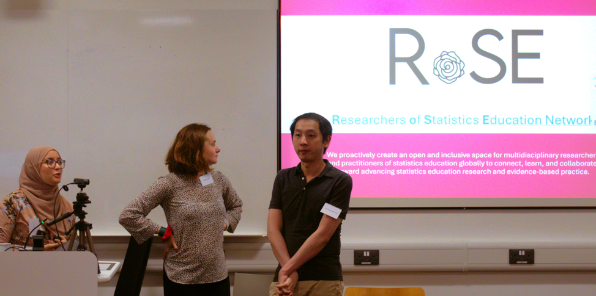
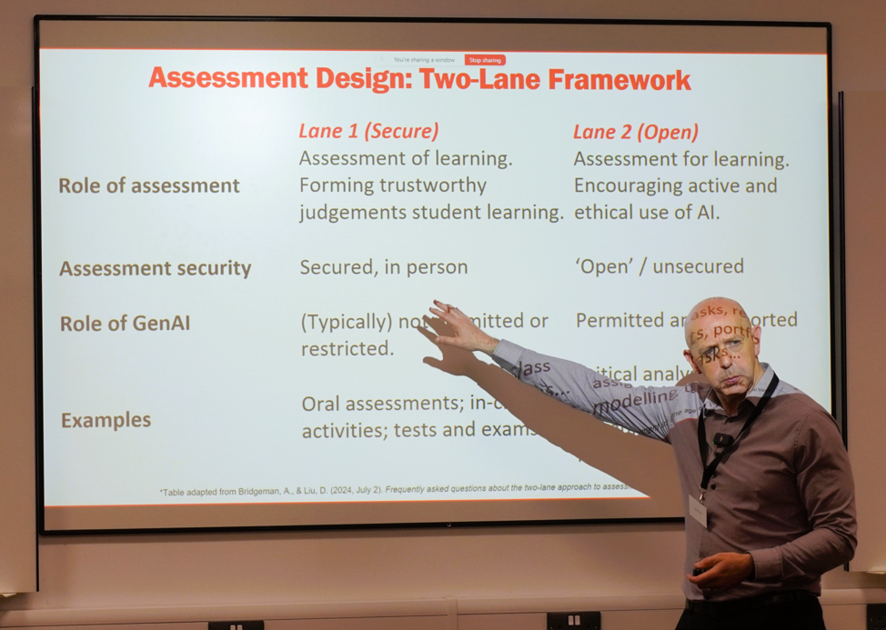
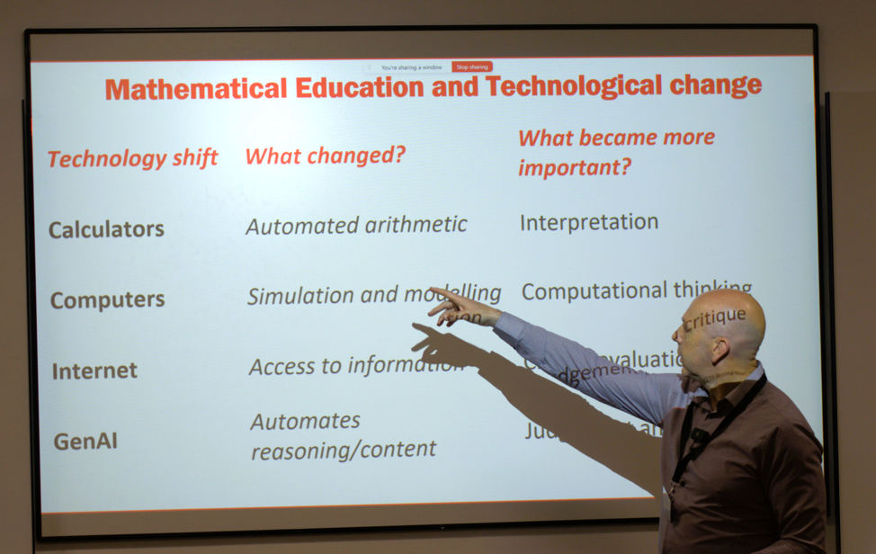
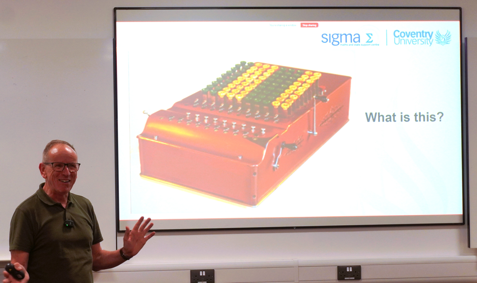
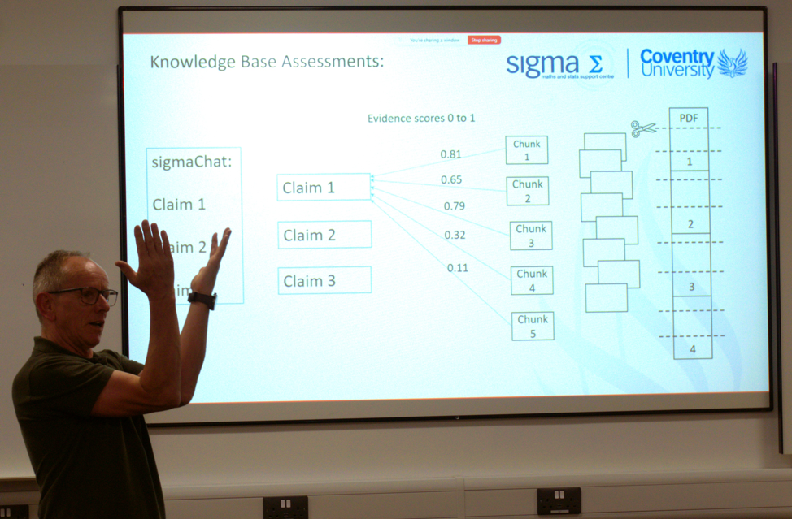
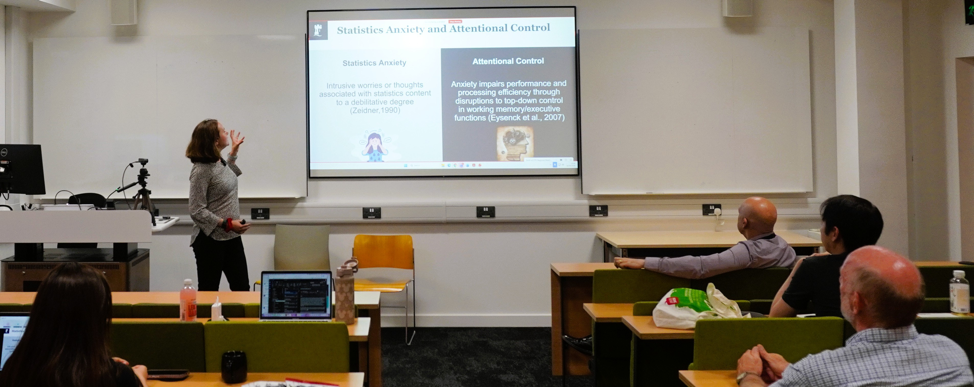
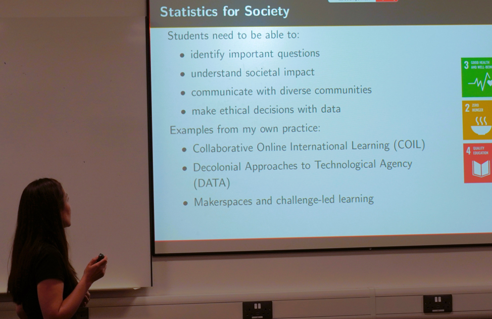
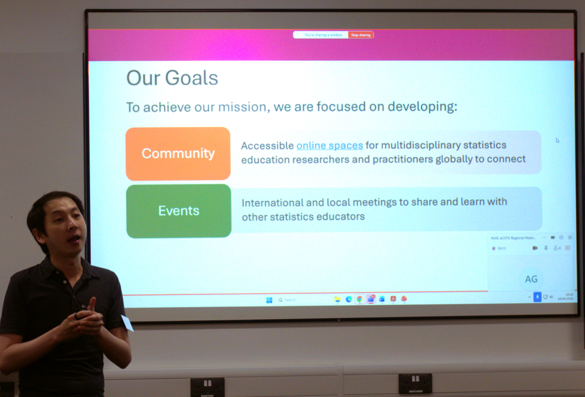
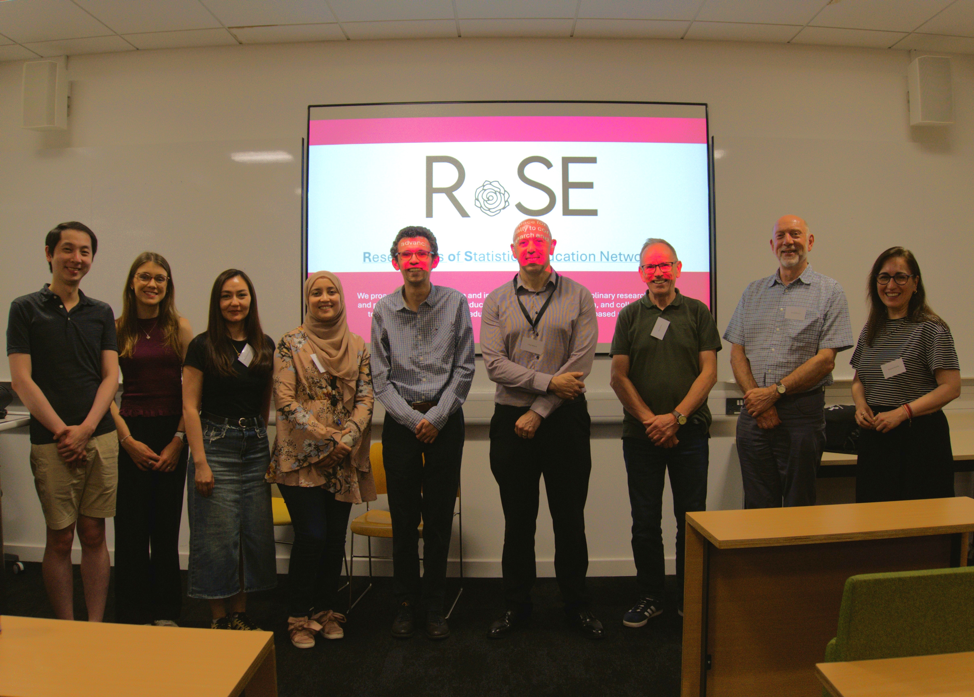

{width=95% fig-align="center"}

We had a keynote talk by [Dr Robert Wilson](https://profiles.cardiff.ac.uk/staff/wilsonrh) from Cardiff University. He spoke about curriculum design in a changing educational landscape, with the fast introduction of AI into our educational environments, and practice in teaching statistics can be done in a different way to support learning.
{width=95% fig-align="center"}

Dr Wilson’s talk was positive and future focused. He likened the shift to previous technological shifts from history:
{width=95% fig-align="center"}

Then we had a keynote talk by [Dr Alun Owen](https://pureportal.coventry.ac.uk/en/persons/alun-owen/) who is head of Coventry University's Statistics Advisory Service. He talked about previous technology too, and showed us a mystery machine (a calculator).
{width=95% fig-align="center"}

Dr Owen spoke about a new tool he has been developing with colleagues at Coventry, called [sigmaChat](https://libguides.coventry.ac.uk/c.php?g=712076&p=5318942). They created an agent and fed it a knowledge base to inform its output. This is intended to be better than off the shelf chatbots, with a design that makes statistics communication to students more nuanced and catered towards student requirements, based on the experience of the educators who support them. 
{width=95% fig-align="center"}

I will admit I have a particular interest in the way that people use arm movements when speaking about statistics, and Dr Owen’s demonstration here was pleasing.
After this, there were some Rapid Talks by [Megan Barnard](https://www.nottingham.ac.uk/psychology/people/megan.barnard1), [Dr Rukia Nuermaimaiti](https://profiles.imperial.ac.uk/r.nuermaimaiti) and [Dr Jacky Chan](https://www.durham.ac.uk/staff/kin-c-chan/).

{width=95% fig-align="center"}

{width=95% fig-align="center"}

{width=95% fig-align="center"}

Overall, I see the developments of statistics education towards mathematics communication skills as part of a mathematics degree, and leadership. Also, more weight towards critical analysis. 

{width=95% fig-align="center"}

Photography and write up by [Stephanie Dickinson](https://www.ucl.ac.uk/mathematical-physical-sciences/stephanie-dickinson).



 



